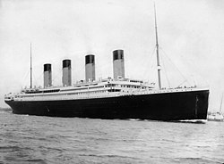

# EDA for Titanic dataset
Nadav Elyakim

## Introduction
In this repo I will present EDA for [Titanic dataset](https://www.kaggle.com/datasets/yasserh/titanic-dataset) and create a classifier to predict who will survive and who will not.\
The model need to be **explainable**, and highlight the more **informative features**.

1. **Imports & Installations & confige**
2. **EDA** 
    * Load and clean the data set
    * Analyzing the features and their relationships
    * Features engineering
3. **Modelds** 
    * Random Forest model
    * Random Forest model - tune hyperparameter
    * Logistic Regression - model which developed from scratch (OOP)

### Running the model
In order to view the project and run the code use the [Notebook](https://github.com/NadavElyakim27/titanic_EDA/blob/main/notebook.ipynb) on jupyter or googlecolab

### Note

To my best understanding, the main purpose of the exercise is to assess my **coding skills** and handling of Exploratory Data Analysis (**EDA**):
1. I tried to be as original as possible and not rely on numerous examples available on the internet (even there are sophisticated things online but not authentic).
2. I emphasized code quality - documentation, readable, and usable.
3. I demonstrated the usage of python modules.
4. I illustrated the use of popular data science libraries - numpy, pandas, matplotlib, seaborn, sklearn.
5. I demonstrated  a simple model develop from scratch while utilizing Object-Oriented Programming (OOP).

## Thanks

