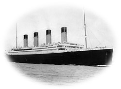

# EDA for Titanic dataset
Nadav Elyakim

## Introduction
In this repo I will present EDA for [Titanic dataset](https://www.kaggle.com/datasets/yasserh/titanic-dataset) and create a classifier to predict who will survive and who will not.\
The model need to be **explainable**, and highlight the more **informative features**.

1. **The first part** - Imports & Installations & confige
2. **The second part - EDA** 
    * Load and clean the data set
    * Analyzing the features and their relationships
    * Features engineering
3. **The third part -** 
    * Applying the Random Forest model
    * Applying the Random Forest model after finding the best parameter
    * Applying Logistic Regression model which developed from scratch

## Running the model
In order to view the project and run the code the
## [Notebook](https://github.com/ok123123123/Multi_Dim_CP_Detection/blob/main/EMULLR.ipynb) on jupyter or googlecolab
> 

## Thanks

